# scLDL
## Single Cell Label Distribution Learning

Since biology is rarely black and white, and forcing your cells into rigid identity boxes is basically gaslighting. Sometimes a cell is just 60% sure of who it wants to be when it grows up.

scLDL proposes a new framework for cell type annotation from single cell gene expresison profiles.

# LabelEnhancer Module

The `LabelEnhancer` module is a core component of scLDL, designed to recover soft label distributions from hard logical labels (e.g., cluster assignments). It is built upon the **Label Information Bottleneck (LIB)** principle, adapted for single-cell data.

## Theoretical Foundation
scLDL leverages **Variational Inference** and **Concentration Distribution Learning** to recover latent label distributions.

### 1. Label Enhancement via Variational Inference (LEVI)
LEVI treats the label enhancement problem as inference in a generative model. We assume there exists a latent variable $z$ that generates both the input features $x$ (gene expression) and the observed logical labels $l$.
- **Generative Model**: $p_\theta(x, l | z)$
- **Inference Model**: $q_\phi(z | x, l)$

By maximizing the Evidence Lower Bound (ELBO), we learn a latent space $z$ that captures the underlying structure of the data, which is then used to reconstruct the soft label distributions.

$$ \mathcal{L}_{LEVI} = \mathbb{E}_{q(z|x,l)}[\log p(x|z) + \log p(l|z)] - D_{KL}(q(z|x,l) || p(z)) $$

### 2. Concentration Distribution Learning (ConcentrationLE)
ConcentrationLE models the target label distribution as a **Dirichlet Distribution**. Instead of predicting a single probability vector, the network predicts the **Evidence** $e_k$ for each class, which parameterizes the Dirichlet distribution $Dir(\alpha)$, where $\alpha_k = e_k + 1$.

- **Beliefs ($b_k$)**: The probability mass assigned to class $k$. $b_k = e_k / S$, where $S = \sum \alpha_k$.
- **Uncertainty ($u$)**: The unassigned probability mass (background term). $u = K / S$, where $K$ is the number of classes.
- **Objective**: We minimize the Mean Squared Error (MSE) between the expected probability distribution and the ground truth labels, plus a variance regularization term.

### 3. HybridLEVI
**HybridLEVI** combines the best of both worlds:
1.  **VAE Backbone**: Learns a robust, regularized latent space $z$ via LEVI's variational objective.
2.  **Concentration Head**: The decoder predicts Evidence $e$ from $z$, allowing for explicit uncertainty quantification alongside label prediction.

This results in a model that is both generative (good feature learning) and uncertainty-aware (robust predictions).

### 4. HybridLEVI Architecture Schematic

```mermaid
graph TD
    %% Encoder Section
    subgraph "Encoder (VAE)"
        Input_X[Input X] -->|Conv2D / MLP| Hidden[Hidden Layers]
        Hidden --> Mu[Mean μ]
        Hidden --> LogVar[LogVar σ²]
        Mu & LogVar -->|Reparameterize| Z((Latent Z))
    end

    %% Decoders Section
    subgraph "Dual Decoders"
        Z -->|Decoder X| Rec_X[Reconstruction X̂]
        Z -->|Decoder Evidence| Evidence[Evidence e]
        Evidence -->|Softplus + 1| Alpha[Concentration α]
    end

    %% Output & Loss Section
    subgraph "Outputs & Objectives"
        Alpha -->|Normalization| Beliefs[Beliefs b]
        Alpha -->|Inverse Sum| Uncertainty[Uncertainty u]
        
        Rec_X -.->|MSE| Loss_Rec[Reconstruction Loss]
        Evidence -.->|CDL Loss| Loss_CDL[Concentration Loss]
        Z -.->|KL Divergence| Loss_KL[Regularization]
    end

    %% Relationships
    Input_X -.-> Loss_Rec
    True_Labels[True Labels L] -.-> Loss_CDL

    %% Styling
    style Z fill:#444,stroke:#333,stroke-width:2px
    style Beliefs fill:#444,stroke:#333,stroke-width:2px
    style Uncertainty fill:#444,stroke:#333,stroke-width:2px
```



### 4. DiffLEVI: Label Enhancement via Diffusion
**DiffLEVI** represents a paradigm shift from Variational Inference (VAE) to **Conditional Diffusion Models** for label enhancement. It replaces the VAE backbone of LEVI with a CARD (Classification and Regression Diffusion) based model.

#### Theoretical Justification
While VAEs (used in LEVI) are powerful, they impose a restrictive Gaussian assumption on the latent posterior $q(z|x,l)$ and often suffer from "posterior collapse" where the decoder ignores the latent code.

**DiffLEVI** instead models the conditional distribution $p(y|x)$ directly using a diffusion process:
- **Forward Process**: Gradually adds Gaussian noise to the label distribution until it becomes pure noise $y_T$.
- **Reverse Process**: Learn initialized denoising dynamics to recover the clean label distribution $y_0$ starting from noise, conditioned on the input features $x$.
$$ p_\theta(y_{0:T} | x) = p(y_T) \prod_{t=1}^T p_\theta(y_{t-1} | y_t, x) $$

This allows for modeling highly complex, multi-modal label distributions without explicit latent variable optimization, offering potentially sharper and more accurate label recovery.

#### DiffLEVI Architecture Schematic

```mermaid
graph TD
    subgraph "Feature Extractor"
        Input_X[Input X] -->|ResNet / MLP| Features["Features f(x)"]
    end
    
    subgraph "Reverse Diffusion Process (Inference)"
        Prior["Gaussian Noise y_T"] -->|Step T| Y_T["y_T"]
        Y_T -->|Denoise Net| Pred_Noise["Predict Noise ε"]
        Features --> Pred_Noise
        Pred_Noise -->|Subtract Noise| Y_T_1["y_{T-1}"]
        Y_T_1 -.->|Iterate| Y_0["Enhanced Label y_0"]
    end
    
    style Features fill:#444,stroke:#333,stroke-width:2px
    style Y_0 fill:#444,stroke:#333,stroke-width:2px
```



## Implementation Details

### Model Architecture (`src/scLDL/models/label_enhancer.py`)
-   **`LabelEncoder`**: Maps expression vectors to a latent space using LayerNorm and LeakyReLU.
-   **`LabelLogicalDecoder`**: Reconstructs logical labels.
-   **`LabelDistributionDecoder`**: Predicts the soft label distribution.
-   **`LabelGapDecoder`**: Estimates the uncertainty/gap.

### Usage Example

```python
from scLDL.models.label_enhancer import LabelEnhancer
from scLDL.models.trainer import LabelEnhancerTrainer
from scLDL.utils.data import scDataset

# 1. Load Data
dataset = scDataset(adata, label_key='cell_type', spatial_key='spatial')

# 2. Initialize Model
model = LabelEnhancer(x_dim=dataset.get_input_dim(), d_dim=dataset.get_num_classes())

# 3. Train
trainer = LabelEnhancerTrainer(model, lambda_spatial=0.1)
trainer.train(dataloader)

# 4. Predict
distributions = trainer.predict(dataloader)
adata.obsm['X_label_enhanced'] = distributions
```
