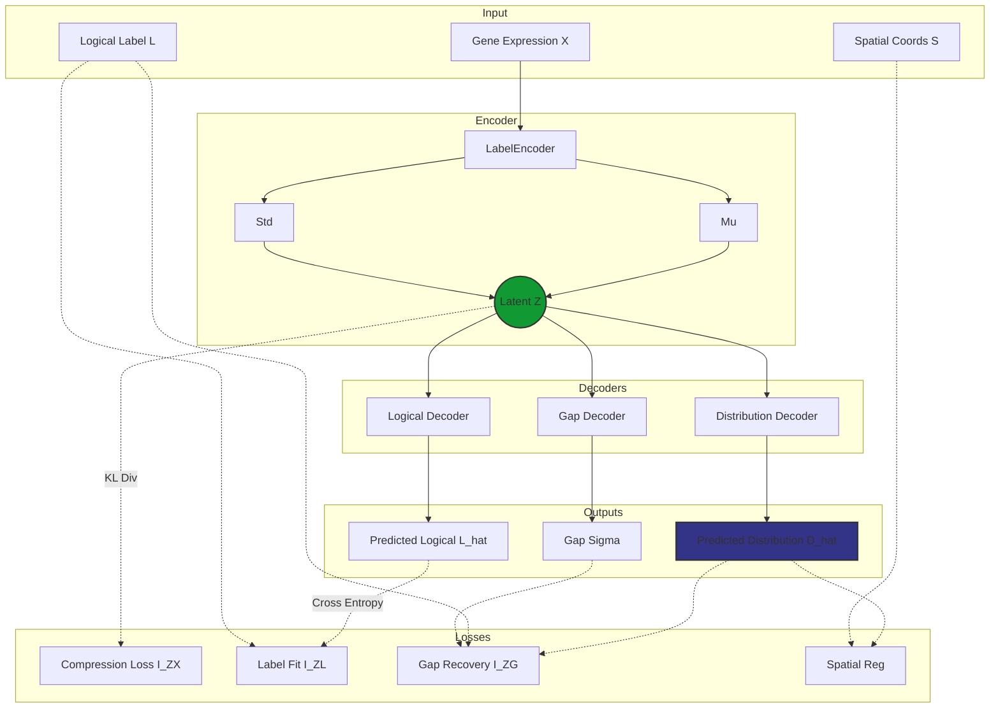

# scLDL
## Single Cell Label Distribution Learning

Since biology is rarely black and white, and forcing your cells into rigid identity boxes is basically gaslighting. Sometimes a cell is just 60% sure of who it wants to be when it grows up.

scLDL proposes a new framework for cell type annotation from single cell gene expresison profiles.

# LabelEnhancer Module

The `LabelEnhancer` module is a core component of scLDL, designed to recover soft label distributions from hard logical labels (e.g., cluster assignments). It is built upon the **Label Information Bottleneck (LIB)** principle, adapted for single-cell data.

## Theoretical Foundation

**LabelEnhancer** addresses the Label Enhancement (LE) problem by treating the observed logical label as a "compressed" version of the true latent label distribution. It uses the Information Bottleneck (IB) framework to "uncompress" this signal.

### 1. Problem Formulation
Let $\mathcal{X} \in \mathbb{R}^d$ be the input feature space (gene expression) and $\mathcal{L} = \{0, 1\}^c$ be the logical label space. The goal is to recover the latent **Label Distribution** $D \in \Delta^{c-1}$.
We assume:

$$ D = L + G $$

where $G$ is the **Label Gap** (the missing distributional information).

### 2. Information Decomposition
We decompose the mutual information between the latent representation $Z$ and the target distribution $D$:

$$ I(Z; D) \approx I(Z; L) + I(Z; G) $$

The objective function maximizes this information while compressing the input $X$:

$$ \mathcal{L}_{LIB} = \underbrace{I(Z; L)}_{\text{Label Fit}} + \underbrace{I(Z; G)}_{\text{Gap Recovery}} - \beta \underbrace{I(Z; X)}_{\text{Compression}} $$

### 3. Final Objective Function
The total loss function minimized during training is:

$$ \mathcal{L}_{total} = \mathcal{L}_{CE}(\hat{L}, L) + \beta D_{KL}(p(z|x) || \mathcal{N}(0,I)) + \lambda_{gap} \mathcal{L}_{gap} + \lambda_{spatial} \mathcal{L}_{spatial} $$

where $\mathcal{L}_{spatial}$ is our custom addition for spatial transcriptomics, penalizing distributional divergence between spatial neighbors.

### 4. Framework Schematic



## Implementation Details

### Model Architecture (`src/scLDL/models/label_enhancer.py`)
-   **`LabelEncoder`**: Maps expression vectors to a latent space using LayerNorm and LeakyReLU.
-   **`LabelLogicalDecoder`**: Reconstructs logical labels.
-   **`LabelDistributionDecoder`**: Predicts the soft label distribution.
-   **`LabelGapDecoder`**: Estimates the uncertainty/gap.

### Usage Example

```python
from scLDL.models.label_enhancer import LabelEnhancer
from scLDL.models.trainer import LabelEnhancerTrainer
from scLDL.utils.data import scDataset

# 1. Load Data
dataset = scDataset(adata, label_key='cell_type', spatial_key='spatial')

# 2. Initialize Model
model = LabelEnhancer(x_dim=dataset.get_input_dim(), d_dim=dataset.get_num_classes())

# 3. Train
trainer = LabelEnhancerTrainer(model, lambda_spatial=0.1)
trainer.train(dataloader)

# 4. Predict
distributions = trainer.predict(dataloader)
adata.obsm['X_label_enhanced'] = distributions
```
