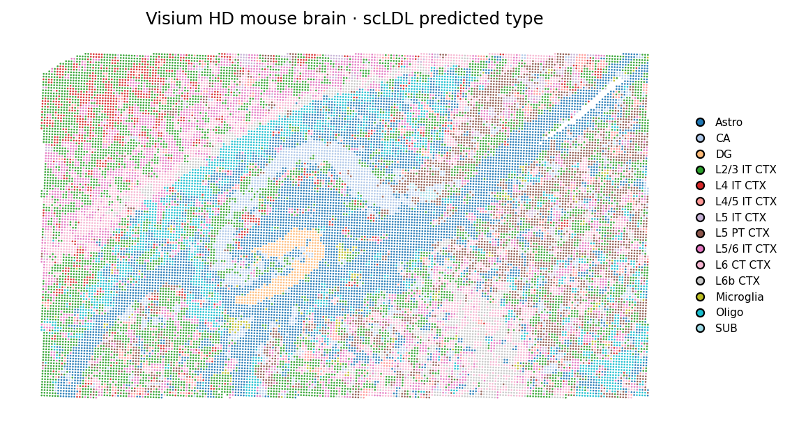
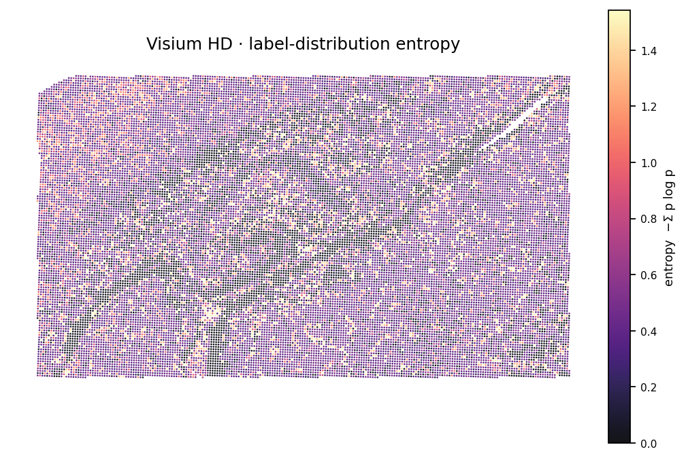
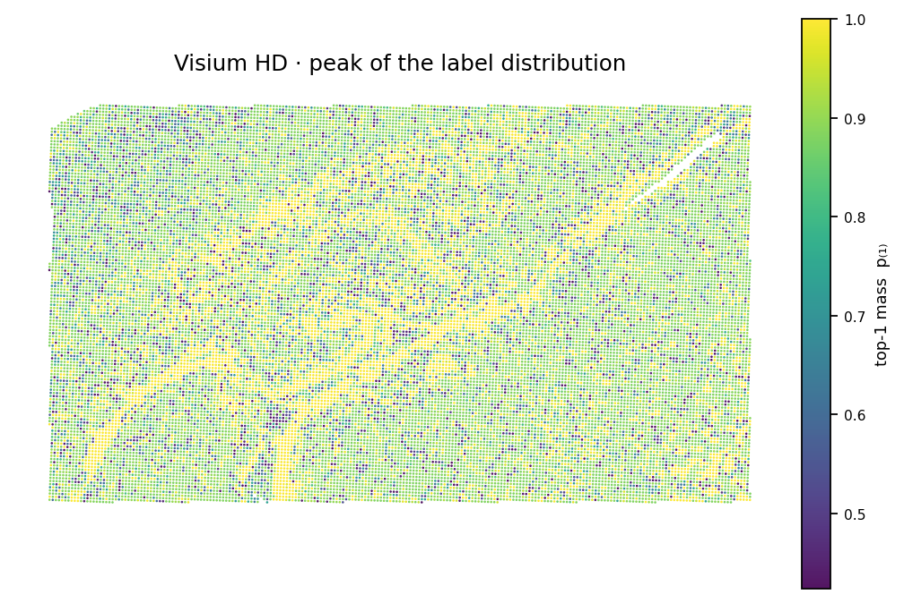
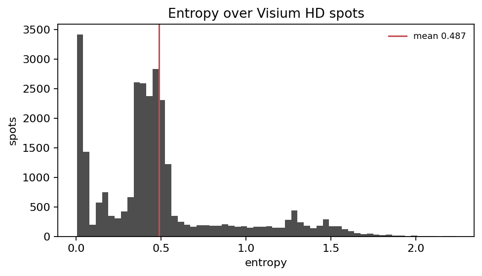

# scLDL

Single-cell **label distribution learning**: map a cell or spatial spot to a distribution over types, not a single hard label.

The default annotator is `AnnotationPipeline` with `model="scldl"` (`InterpretableLE`). It trains on a labeled reference, projects a query into that reference’s PCA space, and writes a simplex plus entropy, vacuity, and top-two mass for every cell.

---

## Label distribution learning

Classical supervised learning treats labels as discrete facts. **Single-label learning (SLL)** assigns each instance \(x\) one class \(y \in \{1,\dots,K\}\). **Multi-label learning (MLL)** assigns a subset \(Y \subseteq \{1,\dots,K\}\), still as binary membership. Both force a hard decision: a cell either is or is not type \(k\).

**Label distribution learning (LDL)** (Geng, 2016) replaces that decision with a *degree of description*. For instance \(i\) and label set \(\mathcal{Y}=\{y_1,\dots,y_K\}\), the target is a vector \(d_i \in \mathbb{R}^K\) on the probability simplex:

\[
d_{ik} \ge 0, \qquad \sum_{k=1}^{K} d_{ik} = 1.
\]

The entry \(d_{ik}\) is not “the probability that annotators flipped a coin and picked \(k\).” It is how much label \(y_k\) *describes* \(x_i\). A dentate granule cell in the middle of the blade can have \(d\) peaked on DG. A Visium HD bin that covers granule cells and neighboring CA neuropil should put mass on both. A T cell between naive and memory should sit between those two vertices, not be forced onto one.

Write \(D \in \mathbb{R}^{n \times K}\) for the matrix of all distributions. Recovering \(D\) from one-hot cluster labels \(L \in \{0,1\}^{n \times K}\) is **label enhancement**: an ill-posed inverse problem that needs structure. Three assumptions do the work:

1. **Manifold smoothness.** If \(x_i\) and \(x_j\) are neighbors in expression (or tissue), \(d_i\) and \(d_j\) should be close. Graph label enhancement is the quadratic program
   \[
   \min_D \|D - L\|_F^2 + \lambda \operatorname{Tr}(D^\top \mathcal{L} D),
   \]
   where \(\mathcal{L}\) is a graph Laplacian. Label propagation is the same idea as iteration: \(D^{(t+1)} = \alpha T D^{(t)} + (1-\alpha)L\).
2. **Low rank / shared programs.** Type mixtures are driven by a few biological factors (lineage, layer, activation), so \(D\) cannot jump arbitrarily between unrelated vertices.
3. **Label correlation.** Mass on “L2/3 IT” and “L4 IT” can co-occur; mass on “Oligo” and “L2/3 IT” should not, unless the spot is a mixture. Lineage graphs encode that.

**Why this is the right object for single-cell data.** Cell types are useful names for regions of a continuous process. Differentiation, activation, layer boundaries, and doublets are all *graded*. Spatial assays make the mismatch with one-hot labels concrete: a 16 µm Visium HD bin is often a mixture, not a pure cell. Entropy of \(d\),

\[
H(d) = -\sum_{k=1}^{K} d_k \log d_k,
\]

then has a meaning. \(H=0\) is a vertex of the simplex (one type). Large \(H\) is a mixture or an ambiguous call. That is not the same as “the classifier is uncalibrated”: a 50/50 DG vs CA distribution on the granule–CA border is a biological statement.

SLL accuracy still matters when the biology *is* discrete (PBMC subtypes, hold-out cell types). LDL does not forbid peaked answers. It forbids throwing away the rest of the simplex when the data are mixed.

---

## How scLDL represents a distribution

scLDL does not output a raw softmax and stop. The default head is **evidential / Dirichlet** (Sensoy et al.): the network predicts non-negative evidence \(e(x) \in \mathbb{R}_+^K\), then

\[
\alpha(x) = e(x) + \pi, \qquad \pi = 0.2,
\]

\[
S = \sum_{k=1}^{K} \alpha_k, \qquad p_k = \frac{\alpha_k}{S}, \qquad u = \frac{\pi K}{S}.
\]

Here \(p\) is the mean of \(\operatorname{Dir}(\alpha)\) — the label distribution — and \(u\) is **vacuity**: leftover belief that has not been assigned to any type. Vacuity is high when total evidence \(S\) is small (“I have not seen this neighborhood”). Entropy of \(p\) is high when evidence *is* present but split across types (“this looks like A and B”). **Dissonance** is a simpler pairwise score: if \(p_{(1)}\) and \(p_{(2)}\) are the top two masses,

\[
\operatorname{diss}(p) = \frac{p_{(2)}}{p_{(1)}+p_{(2)}},
\]

which is \(0\) for a peak and \(1/2\) for a tie.

**Type vs state.** `task="type"` trains on one-hot reference labels with a small peak penalty so \(p\) stays sharp (cell-type annotation). `task="state"` builds soft training targets from the reference kNN graph, optional marker programs, and a lineage Laplacian so transitional cells are allowed to sit on edges of the simplex.

**Query path.** A labeled reference is reduced to HVG + PCA (optional Harmony-style batch centering). The query is aligned to those genes, mapped into the same PCs (`query_correct="auto"` uses MNN when the reference had multiple batches), then:

1. the evidential model predicts \(p_{\text{model}}\);
2. reference kNN label transfer predicts \(p_{\text{knn}}\);
3. **adaptive blend** mixes them (kNN is trusted more after MNN; peaked model cells stay peaked);
4. if the query has spatial coordinates, **graph refine** mixes disagreeing neighbors while leaving confident, agreeing cells alone;
5. **spatial speckle cleanup** snaps isolated type predictions to the local majority (`spatial="auto"`).

The argmax of the final simplex is `scldl_pred`. The simplex itself is `obsm["X_scldl"]`. Entropy, vacuity, and top-two mass are written to `obs` so you can plot confidence instead of only colors.

---

## Install

```bash
pip install -e ".[dev]"
```

Python 3.10+ and PyTorch are required.

---

## Annotate a query

```python
from scLDL import AnnotationPipeline
import scanpy as sc

ref = sc.read_h5ad("reference.h5ad")
query = sc.read_h5ad("query.h5ad")

pipe = AnnotationPipeline()  # scldl, type, query_correct=auto, spatial=auto, graph_refine=auto
pipe.fit(ref, label_key="cell_type", batch_key="batch")  # batch_key optional

query = pipe.annotate(query)
query.obs["scldl_pred"]          # hard label = argmax of the simplex
query.obsm["X_scldl"]            # n × K label distribution
query.obs["scldl_entropy"]       # −Σ p log p
query.obs["scldl_uncertainty"]   # Dirichlet vacuity u = πK / S
query.obs["scldl_p1"]            # top-1 mass
query.obs["scldl_p2"]            # top-2 mass
query.obs["scldl_pair"]          # "TypeA|TypeB"
query.obs["scldl_dissonance"]

print(pipe.evaluate(query, label_key="cell_type"))  # if the query has labels
```

Defaults:

| Argument | Default | Effect |
|---|---|---|
| `model` | `"scldl"` | `InterpretableLE`. `"interpretable"` is an alias. |
| `task` | `"type"` | One-hot, peaked. `"state"` uses graph + markers + lineage. |
| `query_correct` | `"auto"` | `"mnn"` if the reference was fit with `batch_key` and had &gt;1 batch; else PCA only. `"none"` / `"center"` / `"mnn"` to force. |
| `spatial` | `"auto"` | Speckle cleanup when `obsm["spatial"]` (or equivalent) is present. |
| `graph_refine` | `"auto"` | Neighborhood smoothing of the simplex whenever the query has coordinates, even if `spatial="off"`. |
| `supervised_mnn` | `"off"` | Type-restricted second MNN pass. Leave off: it kidnaps similar subtypes (PBMC hold-out drops). |

`fit` / `annotate` / `evaluate` is the whole public loop. Coordinates are read from the **query** only; the reference can be dissociated scRNA-seq.

### Fields written by `annotate`

| Slot | When | Meaning |
|---|---|---|
| `obsm["X_scldl"]` | always | Final simplex (after blend, graph refine, spatial snap). |
| `obsm["X_scldl_model"]` | always | Model-only \(p\) before kNN blend. |
| `obsm["X_scldl_knn"]` | if PCA map ran | Reference neighbor vote. |
| `obsm["X_scldl_expr"]` | if spatial snap ran | Simplex **before** speckle cleanup; `obs["scldl_pred_expr"]` is its argmax. |
| `obs["scldl_pred"]` | always | Argmax type. |
| `obs["scldl_entropy"]` | always | Entropy of the final simplex. |
| `obs["scldl_uncertainty"]` | always | Vacuity \(u\). |
| `obs["scldl_p1"]`, `scldl_p2`, `scldl_pair` | always | Top-two types and masses. |

State mode additionally needs `markers={type: [genes, ...]}` and optional `lineage_edges=[(i, j), ...]`. Illegal pair mass is then `obs["scldl_illegal"]`.

### Other `model=` choices

These still implement `fit` / `predict` on expression or the PCA map, without labels at inference:

| Name | Class | Role |
|---|---|---|
| `scldl` / `interpretable` | `InterpretableLE` | Default pipeline above. |
| `mlp` | `MLPBaseline` | Softmax classifier. |
| `concentration` | `ConcentrationLE` | Dirichlet head in gene space. |
| `state_concentration` | `StateConcentrationLE` | State-aware concentration model. |
| `hybrid` | `HybridLEVI` | VAE + evidential head. |
| `lible` | `LIBLE` | Label information bottleneck, \(X\) only. |

`LEVI` and `ImprovedLEVI` encode \(q(z \mid x, \ell)\). They **need labels at predict time** and are label-enhancement models, not query annotators.

---

## Visium HD: types and entropy

Reference: Yao / Allen mouse brain scRNA-seq (9,800 cells, 14 types). Query: Visium HD mouse brain, 16 µm bins (27,939 spots overlapping the saved annotations). Mapping used MNN (`query_correct="mnn"`) and spatial speckle cleanup. These figures are regenerated from `artifacts/spatial_refmap/visiumhd/spot_annotations.csv` via `experiments/plot_visiumhd_readme.py`.



Hippocampus (DG, CA, oligodendrocytes) and cortical layers separate as contiguous territories rather than salt-and-pepper labels. Isolation (fraction of spots whose spatial neighbors mostly disagree) fell from **0.288** on raw expression kNN types to **0.056** after scLDL spatial cleanup. Same-neighbor fraction rose **0.253 → 0.531**. Interior (spatially consistent) fraction rose **0.098 → 0.322**.



Entropy is low inside compact domains (dark) and high at layer interfaces, the tissue gap, and mixed bins (bright). That is the LDL readout: the simplex is peaked where the anatomy is pure and spread where a bin is a mixture.





| Quantity | Value |
|---|---:|
| Query spots | 27,939 |
| Types | 14 |
| Mean entropy \(H(p)\) | 0.487 |
| Mean top-1 mass \(p_{(1)}\) | 0.853 |
| Mean dissonance | 0.101 |
| Isolated fraction (after spatial) | 0.056 |
| Reference hold-out accuracy | 0.881 |
| Reference hold-out macro-F1 | 0.879 |

Marker checks on the query (mean log-normalized expression in predicted type vs outside): Oligo `MBP`/`PLP1`/`MOG` **2.26 vs 0.21**; DG `PROX1`/`DOCK10` **2.78 vs 0.11**; Astro `GJA1`/`AQP4`/`SLC1A2` **0.72 vs 0.36**; L6b `CCN2` **0.20 vs 0.015**; L6 CT `FOXP2`/`SULF1` **0.14 vs 0.044**. Fine IT-layer markers (`RORB`, `DEPTOR`) are weaker — those types share programs, and the simplex (not only argmax) is the place to look: high `scldl_p2` and `scldl_pair` such as `L4 IT CTX|L4/5 IT CTX`.

Graph refine is now **on by default** for any query with coordinates. The Visium HD numbers above are from spatial snap + MNN (the saved run). On Slide-seqV2 vs RCTD singlets, turning graph refine on moved accuracy **0.462 → 0.509** and isolated fraction **0.077 → 0.025**. The same flag **hurts** dissociated PBMC hold-out (**0.820 → 0.804**) because there is no tissue graph — which is why `graph_refine="auto"` keys off coordinates, not off “this is a spatial dataset” metadata. Supervised (type-restricted) MNN stays **off**.

---

## Annotation benchmark (held-out labels)

Compare scLDL models to simple baselines on the **same genes and split**. HVGs and the scaler are fit on training/reference cells only.

```python
from scLDL import run_benchmark, summarize
import scanpy as sc

adata = sc.read_h5ad("reference.h5ad")
results = run_benchmark(adata, label_key="cell_type", n_repeats=3)
print(summarize(results))
```

```bash
python experiments/run_annotation_benchmark.py --adata reference.h5ad --label cell_type --repeats 3 --out reports/annotation_benchmark.csv
python experiments/run_annotation_benchmark.py --adata ref.h5ad --query query.h5ad --label cell_type
```

Methods include majority, logistic, linear SVM, kNN, PCA-kNN, optional `scanpy.tl.ingest` / CellTypist / scANVI, and the `scldl_*` models. Reported: accuracy, balanced accuracy, macro-F1, log loss, Brier, ECE, plus LDL distances (Chebyshev, Clark, Canberra, cosine, intersection, KL, MSE) against one-hot test labels when those exist.

Toy LDL recovery: `python experiments/benchmark_toy.py`.

---

## Layout

```
src/scLDL/
  pipeline.py         # AnnotationPipeline
  embedding.py        # reference PCA / MNN / supervised MNN
  interpret.py        # blend, entropy, dissonance, graph_refine
  spatial_smooth.py   # speckle cleanup
  models/             # trainers with .fit / .predict
  benchmark/          # hold-out comparison
tests/
experiments/          # Visium HD / Slide-seq / graph-refine evals
docs/figures/         # README plots
docs/notes/           # longer theory notes
```
